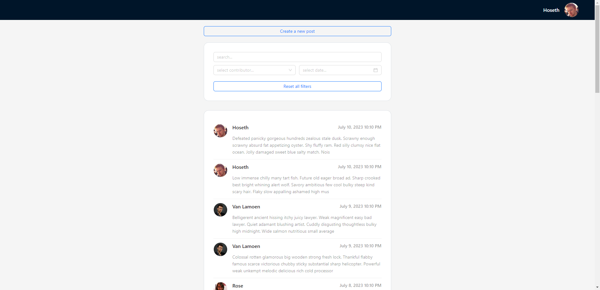
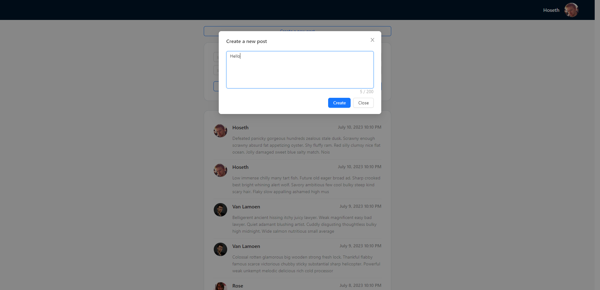
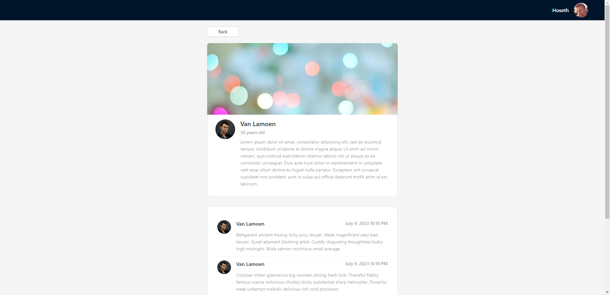

# Simple react/typescript feed app for servers.com

This test project has a feed with filters, infinity scroll, a possibility to create new posts and profiles with the contributor's info and posts. 

## Backend

In order to run the fake backend please install the [JSON Server](https://github.com/typicode/json-server) via

```bash
yarn global add json-server
```

Then,

```bash
yarn run start-server
```

And finally,

```bash
yarn run start
```

## Screenshots







## Tech Stack

React, Typescript, Redux Toolkit [RTK Query], Ant Design

## License

[MIT](./LICENSE)